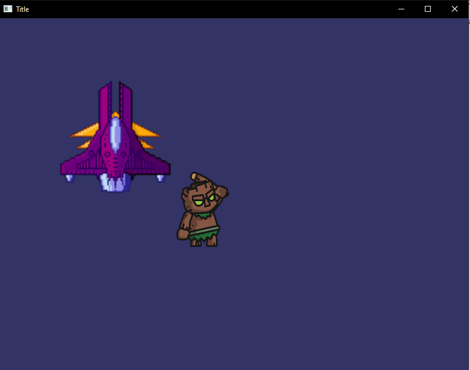

# FYPEngine

### How to setup project

##### Requirements
	1. Git Bash
	3. Python 3.7 or above
	2. Pycharm

##### Setup
First we need to use **git bash** to download the remote repository to your project folder

```bash
git init
git clone https://github.com/kingstonxy/FYPEngine.git
```
After this make a new **Pycharm** project in the same folder. Now we need to configure the 
virtual environment for the project, we can add a new virtual environment by either:

 - Press the Interpreter widget at the bottom right of the editor
 - CTRL+ALT+S to go into the settings, Project > Project Interpreter > Click the gear icon > Add Interpreter

Now we need to run requirements.txt file using pip in the pycharm terminal to install the required libraries. 
```bash
pip install -r requirements.txt
```
The project should be setup now and to check if everything is working properly run the **main.py** or **main2.py** files, in the FYPEngine\Source folder, 
to start either of the sample games.

### Making a new game
To make a game, first we need to make a subclass of the LevelManager class and making game objects using the Sprite class. We can make sprites by 
including the path to an xml file, but object can also without an external xml and initializing all Sprite variables through python.
#### tutorialGame.py
```python
import os
from Source.System.System import System
from Source.System.LevelManager import LevelManager
from Source.System.gameObject import Sprite


class LevelTest(LevelManager):

    def InitLevel(self):
        super().InitLevel()

        player = Sprite(os.path.dirname(__file__) + "/../res/GameObjects/Player.xml")
        Obj1 = Sprite(os.path.dirname(__file__) + "/../res/GameObjects/Object1.xml")
        self.AddObject(player)
        self.AddObject(Obj1)
```
After this we need to make a new System object and pass it our Level Object. Then initalize the Level and start our Gameloop
```python
newSystem = System()
Level1 = LevelTest(newSystem)

newSystem.LevelManager = Level1

Level1.InitLevel()
newSystem.GameLoop()
```
This will start rendering the required objects.

